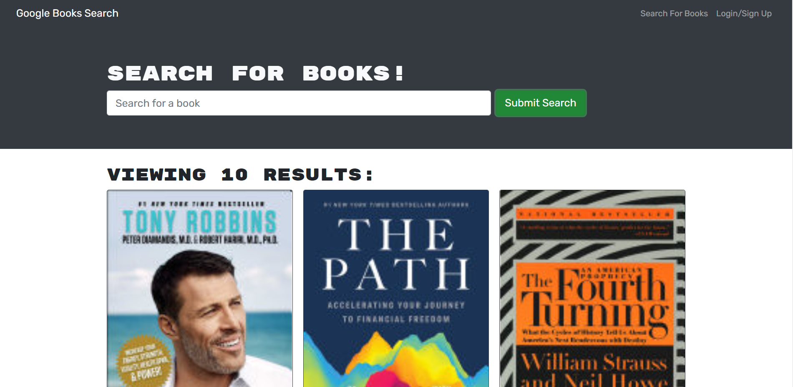

# MERN Structured Book Search

## Description
This application utilizes MongoDB, Express, React, and Node.js in order to perform a book search via a Google Book 3rd party api. Users are able to search for a book title or an author. If the user like a particular book, they can save the book and view it in their 'SavedBooks' section. In the 'SavedBooks' page the user is able to delete a saved book.

## Table of Contents
* [License](#license)
* [Installation](#installation)
* [Usage](#usage)
* [Screenshots](#screenshots)
* [Contacts](#contacts)

## License:

## Usage
Checkout my application: [Link](https://protected-mountain-50676.herokuapp.com/) 

## Screenshots

.png)

## Contacts
### GitHub: 
[My Github](https://github.com/AliCelikay)
### Email:
alicelikay129@gmail.com
